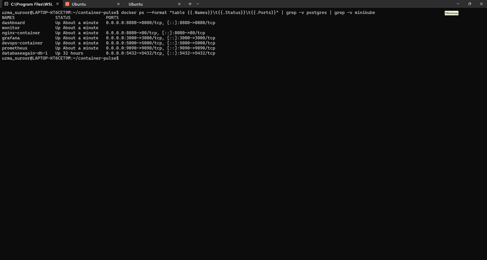
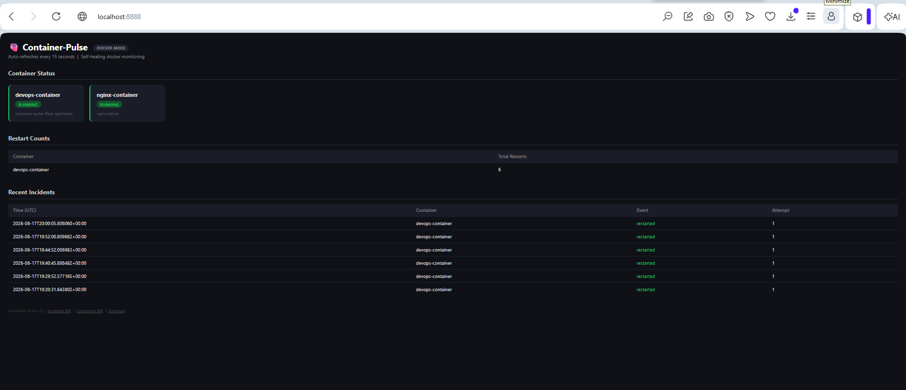
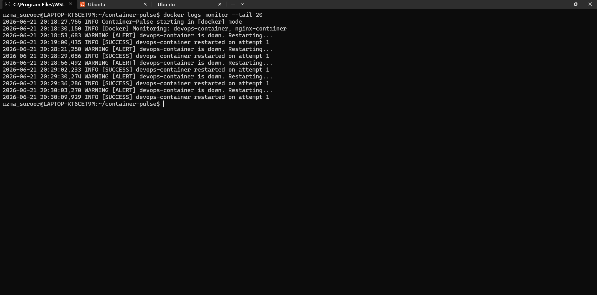
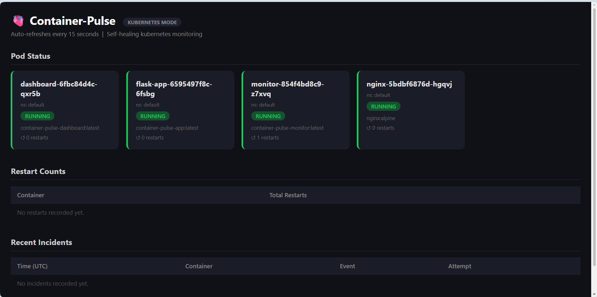
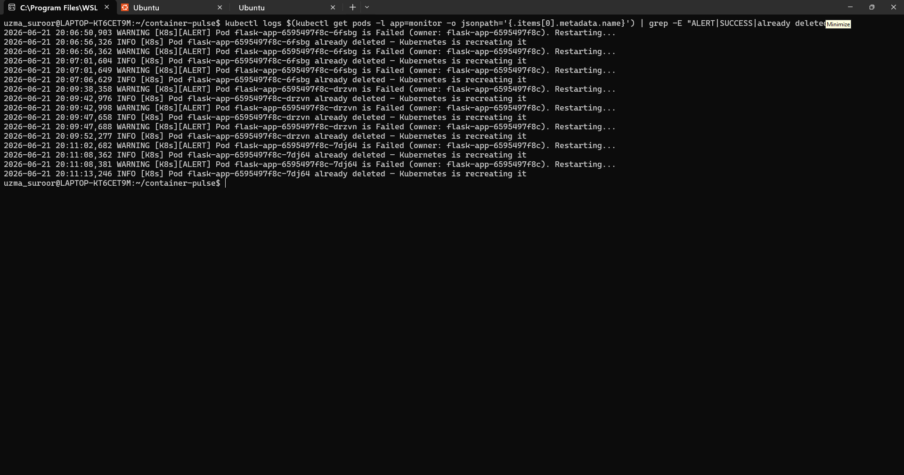
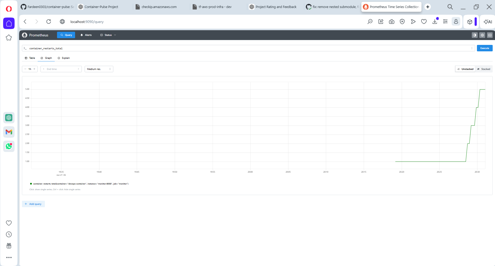
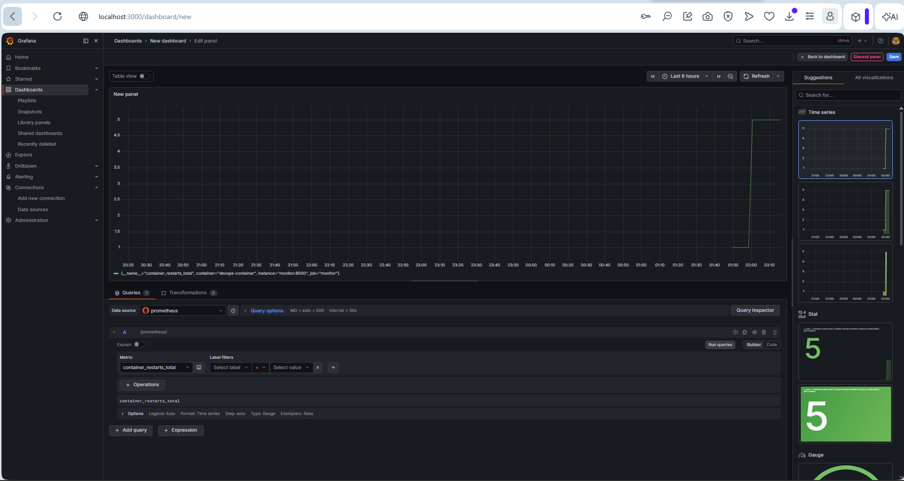
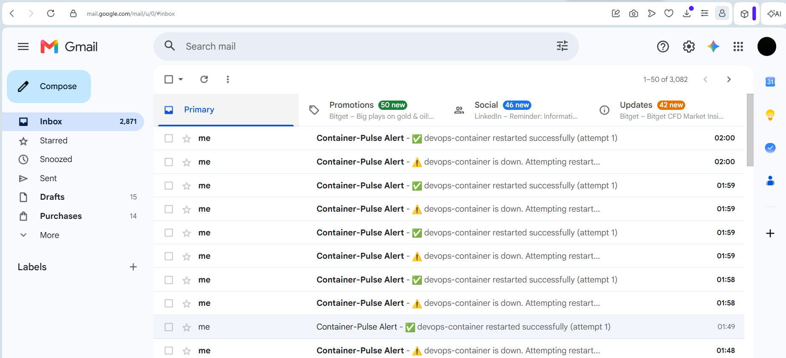

# 🫀 Container-Pulse

> Cloud-native self-healing monitoring platform for Docker containers and Kubernetes workloads — with real-time alerting, observability, incident history, and automated infrastructure provisioning.


---

## 📌 Overview

Container-Pulse is a production-grade self-healing infrastructure platform that continuously monitors Docker containers and Kubernetes pods. When a workload goes down, it automatically detects the failure, attempts to restart it with retry logic, sends real-time alerts via Slack or Email, and records every incident in a database — all while exposing live metrics to Prometheus and Grafana and displaying everything on a live FastAPI dashboard.

Infrastructure is provisioned automatically on AWS EC2 using Terraform with a single `terraform apply`.

---

## ✨ Features

| Feature | Description |
|--------|-------------|
| 🔁 Auto Restart | Detects and restarts failed Docker containers and Kubernetes pods |
| 🔄 Retry Logic | Up to 3 restart attempts before marking as critical |
| 🧠 Failure Prediction | Warns when CPU > 80% or memory > 85% — before failure happens |
| 🔔 Multi-Channel Alerts | Slack and Email notifications via plugin architecture |
| 📊 7 Prometheus Metrics | container_up, restarts, failures, health_checks, alerts_sent, CPU%, memory% |
| 📈 Grafana Dashboard | Live visualization of container health and metrics |
| 🖥️ FastAPI Dashboard | Live web UI showing container status, incident history, restart counts |
| 🗄️ Incident Database | SQLite stores every failure, restart, and recovery event |
| ☸️ Kubernetes Support | Watches pods, detects Failed/Unknown phases, detects CrashLoopBackOff |
| 🏗️ Terraform IaC | Provisions AWS EC2 + security groups with one command |
| 🚀 AWS Ready | Terraform provisions EC2 + Minikube — deploy with `terraform apply` |
| 💥 Chaos Testing | Shell script kills containers and measures mean recovery time |
| 📝 Structured Logging | Timestamped logs saved to file |

---

## 🛠 Tech Stack

| Layer | Technology |
|-------|-----------|
| Language | Python 3.10 |
| Containerization | Docker, Docker Compose |
| Orchestration | Kubernetes, Minikube |
| Monitoring | Prometheus, Grafana |
| Dashboard | FastAPI, Jinja2 |
| Database | SQLite |
| Alerting | Slack, Email (SMTP) |
| IaC | Terraform |
| Cloud | AWS EC2 |
| Testing | Pytest, pytest-cov |
| CI/CD | GitHub Actions |

---

## 🏗 Project Structure

```
container-pulse/
├── app/                        # Flask demo application (monitored workload)
│   ├── app.py
│   └── Dockerfile
├── monitor/                    # Self-healing monitor service
│   ├── monitor.py              # Main loop — Docker or Kubernetes mode
│   ├── healer.py               # Docker restart logic + failure prediction
│   ├── k8s_healer.py           # Kubernetes pod watcher + self-healing
│   ├── metrics.py              # All 7 Prometheus metrics
│   ├── notifiers.py            # Plugin notifiers: Slack, Email
│   ├── db.py                   # SQLite incident history
│   └── Dockerfile
├── dashboard/                  # FastAPI live dashboard
│   ├── main.py                 # REST API + HTML dashboard
│   ├── templates/
│   │   └── index.html
│   └── Dockerfile
├── k8s/                        # Kubernetes manifests
│   ├── flask-app-deployment.yml
│   ├── nginx-deployment.yml
│   ├── monitor-deployment.yml  # Includes RBAC (ServiceAccount + ClusterRole)
│   └── dashboard-deployment.yml
├── terraform/                  # AWS infrastructure as code
│   ├── main.tf                 # EC2 + security groups
│   ├── variables.tf
│   ├── outputs.tf              # Prints IPs and URLs after apply
│   └── user_data.sh            # Bootstraps Docker, Minikube, kubectl, app
├── prometheus/
│   └── prometheus.yml
├── tests/                      # Real unit tests with mocks
│   ├── test_healer.py
│   ├── test_k8s_healer.py
│   ├── test_notifiers.py
│   └── test_db.py
├── .github/workflows/
│   └── ci.yml                  # CI pipeline
├── chaos_test.sh               # Chaos testing + recovery time report
├── logs/
├── docker-compose.yml
└── .env
```

---

## 🚀 Quick Start — Docker Mode

**1. Clone the repository**
```bash
git clone https://github.com/Fardeen0303/container-pulse.git
cd container-pulse
```

**2. Configure environment**
```bash
cp .env.example .env
# Edit .env and add your credentials
```

**.env options:**
```bash
SLACK_WEBHOOK=https://hooks.slack.com/services/your/webhook
SMTP_HOST=smtp.gmail.com
SMTP_PORT=587
SMTP_USER=you@gmail.com
SMTP_PASSWORD=your_app_password     # Gmail App Password
ALERT_EMAIL=you@gmail.com
MONITORED_CONTAINERS=devops-container,nginx-container
POLL_INTERVAL=20
```

**3. Run everything**
```bash
docker compose up -d --build
```

**4. Verify all containers are running**
```bash
docker ps
```

---

## 📡 Services

| Service | URL |
|---------|-----|
| 🖥️ Dashboard | http://localhost:8888 |
| 🐍 Flask App | http://localhost:5000 |
| 🌐 Nginx | http://localhost:8080 |
| 📊 Prometheus | http://localhost:9090 |
| 📈 Grafana | http://localhost:3000 |

> Grafana login: `admin` / `admin`
> Prometheus data source: `http://prometheus:9090`

---

## 🧪 Test Self-Healing

**Terminal 1 — watch monitor:**
```bash
docker logs -f monitor
```

**Terminal 2 — kill a container:**
```bash
docker stop devops-container
```

Monitor detects the failure within 20 seconds, restarts the container, sends alerts, and records the incident in the database. Refresh http://localhost:8888 to see it in the dashboard.

---

## 💥 Chaos Testing

```bash
bash chaos_test.sh devops-container
```

Output:
```
✅ Recovery Report
----------------------------
Container     : devops-container
Detection+Fix : 12s
Status        : running
----------------------------
```

---

## ☸️ Kubernetes Mode — Minikube

**1. Start Minikube**
```bash
minikube start --driver=docker --cpus=2 --memory=2048
```

**2. Build images inside Minikube**
```bash
eval $(minikube docker-env)
docker build -f app/Dockerfile -t container-pulse-app:latest ./app
docker build -f monitor/Dockerfile -t container-pulse-monitor:latest .
docker build -f dashboard/Dockerfile -t container-pulse-dashboard:latest .
```

**3. Create secrets**
```bash
kubectl create secret generic container-pulse-secrets \
  --from-literal=SLACK_WEBHOOK="" \
  --from-literal=SMTP_HOST="smtp.gmail.com" \
  --from-literal=SMTP_PORT="587" \
  --from-literal=SMTP_USER="you@gmail.com" \
  --from-literal=SMTP_PASSWORD="your_app_password" \
  --from-literal=ALERT_EMAIL="you@gmail.com"
```

**4. Deploy**
```bash
kubectl apply -f k8s/
```

**5. Test self-healing**
```bash
kubectl get pods
kubectl delete pod <flask-app-pod-name>
kubectl logs -f <monitor-pod-name>
```

The monitor detects the failed pod and deletes it — Kubernetes recreates it automatically via the ReplicaSet.

---

## 🏗️ Deploy on AWS with Terraform

**Prerequisites:** AWS CLI configured, SSH key at `~/.ssh/id_rsa.pub`

```bash
cd terraform
terraform init
terraform apply
```

Terraform provisions:
- EC2 t2.micro (free tier)
- Security group (ports 22, 5000, 3000, 8888, 9090)
- Bootstraps Docker, kubectl, Minikube, and deploys the full stack automatically

After apply, outputs print:
```
dashboard_url  = "http://<EC2-IP>:8888"
prometheus_url = "http://<EC2-IP>:9090"
grafana_url    = "http://<EC2-IP>:3000"
ssh_command    = "ssh -i ~/.ssh/id_rsa ubuntu@<EC2-IP>"
```

To destroy and avoid charges:
```bash
terraform destroy
```

---

## 🔁 CI/CD Pipeline

3 jobs run on every push and pull request:

| Job | What it does |
|-----|-------------|
| `lint` | flake8 code style check |
| `test` | pytest with coverage report |
| `docker-build` | builds all 3 Docker images |

---

## 📊 Prometheus Metrics

| Metric | Type | Description |
|--------|------|-------------|
| `container_up` | Gauge | 1 if running, 0 if down |
| `container_restarts_total` | Counter | Total restart attempts per container |
| `container_failures_total` | Counter | Total unrecoverable failures |
| `health_checks_total` | Counter | Total poll cycles completed |
| `alerts_sent_total` | Counter | Alerts sent per channel |
| `container_cpu_percent` | Gauge | Live CPU usage % |
| `container_memory_percent` | Gauge | Live memory usage % |

---

## 🏗️ Architecture

```
                        Container-Pulse v2
┌─────────────────────────────────────────────────────────────┐
│                                                             │
│   ┌──────────────┐    ┌──────────────┐    ┌─────────────┐   │
│   │ Flask App    │    │ Nginx        │    │ Monitor     │   │
│   │ :5000        │    │ :8080        │    │ (healer)    │   │
│   └──────────────┘    └──────────────┘    └───────┤     │   │
│        monitored workloads              │ detects │     │   │
│                                         └────────┘     │   │
│                                              │           │   │
│                    ┌─────────────────────┼───────────┘   │
│                    │             auto-restart + alert     │
│                    │                                      │
│   ┌──────────────┘    ┌───────────┐   ┌───────────┐   │
│   │ SQLite DB    │    │ Slack       │   │ Email       │   │
│   │ incidents    │    │ Alerts      │   │ Alerts      │   │
│   └──────────────┘    └───────────┘   └───────────┘   │
│                                                             │
│   ┌──────────────┐    ┌──────────────┐    ┌───────────┐   │
│   │ FastAPI      │    │ Prometheus   │    │ Grafana    │   │
│   │ Dashboard    │    │ :9090        │    │ :3000      │   │
│   │ :8888        │    │ 7 metrics    │    │ dashboards │   │
│   └──────────────┘    └──────────────┘    └───────────┘   │
│                         observability layer                 │
│                                                             │
│   ┌──────────────┐    ┌──────────────┐    ┌───────────┐   │
│   │ Kubernetes   │    │ Terraform    │    │ GitHub     │   │
│   │ Minikube     │    │ AWS EC2      │    │ Actions CI │   │
│   │ RBAC         │    │ IaC          │    │ 3 jobs     │   │
│   └──────────────┘    └──────────────┘    └───────────┘   │
│                      infrastructure layer                   │
└─────────────────────────────────────────────────────────────┘
```

---

## 📸 Screenshots

### All Containers Running


### Dashboard — Live Container Status & Incident History


### Monitor Logs — Self-Healing in Action


### Kubernetes Pods Running


### Kubernetes Self-Healing in Action


### Prometheus Metrics


### Grafana Dashboard


### Email Alert


---

## 💡 Skills Demonstrated

- Self-healing infrastructure automation
- Docker container orchestration
- Kubernetes pod monitoring and recovery (RBAC, watch API)
- Python software design (plugin architecture, modular codebase)
- System observability (Prometheus metrics, Grafana dashboards)
- Incident management (SQLite history, FastAPI dashboard)
- Multi-channel alerting (Slack, Email)
- Failure prediction (CPU/memory threshold monitoring)
- Infrastructure as Code (Terraform, AWS EC2)
- CI/CD pipeline (flake8, pytest, docker build)
- Chaos engineering and SRE concepts (mean recovery time: 12s)
- Reliability engineering

---

## 👤 Author

**Mohammed Fardeen**
[GitHub](https://github.com/Fardeen0303)
