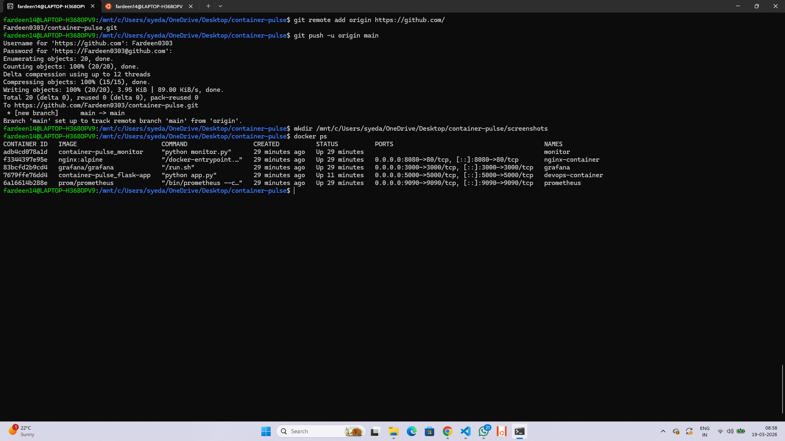
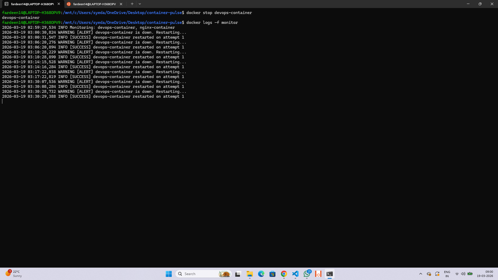
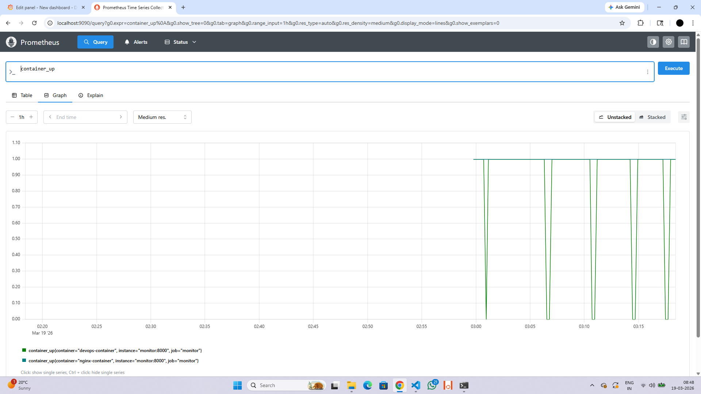
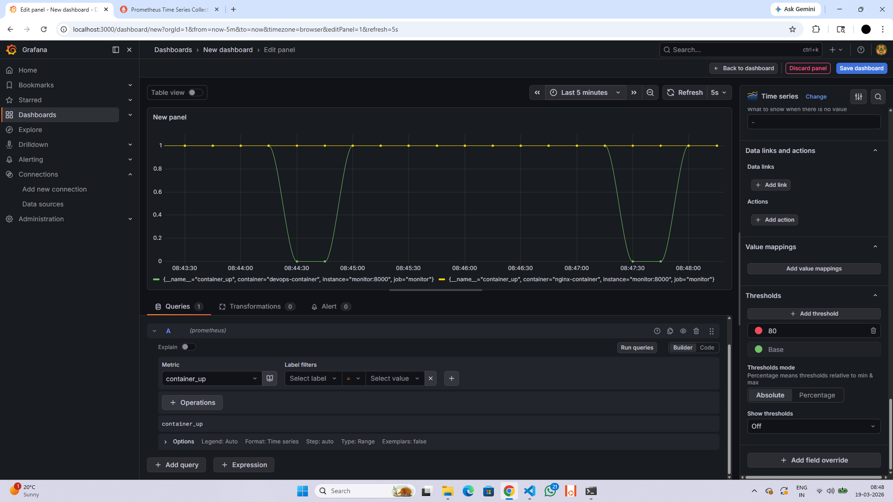
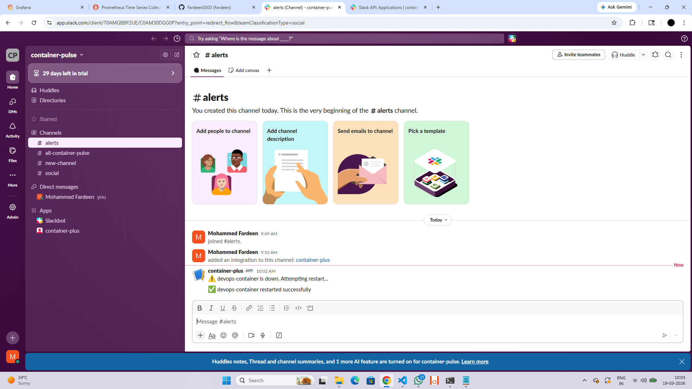
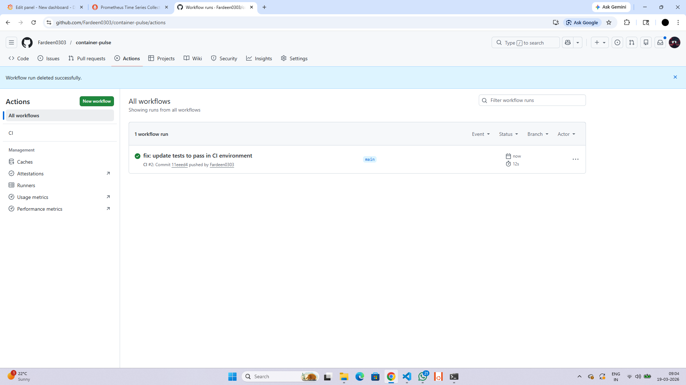

# 🫀 Container-Pulse

> Automated self-healing Docker infrastructure with real-time monitoring, alerting, and observability.


---

## 📌 Overview

Container-Pulse is a production-inspired self-healing infrastructure that continuously monitors Docker containers. When a container goes down, it automatically detects the failure, attempts to restart it with retry logic, and sends real-time Slack alerts — all while exposing live metrics to Prometheus and Grafana.

---

## ✨ Features

| Feature | Description |
|--------|-------------|
| 🔁 Auto Restart | Detects and restarts failed containers automatically |
| 🔄 Retry Logic | Up to 3 restart attempts before marking as critical |
| 🔔 Slack Alerts | Real-time notifications on failure and recovery |
| 📊 Prometheus Metrics | Tracks container status and restart counts |
| 📈 Grafana Dashboard | Live visualization of container health |
| 📝 Structured Logging | Timestamped logs saved to file |
| ⚙️ CI/CD Pipeline | Automated testing via GitHub Actions |

---

## 🛠 Tech Stack

- **Language:** Python 3.10
- **Containerization:** Docker, Docker Compose
- **Monitoring:** Prometheus, Grafana
- **Alerting:** Slack Webhook
- **Testing:** Pytest
- **CI/CD:** GitHub Actions

---

## 🏗 Project Structure

```
container-pulse/
├── app/                  # Flask demo application
│   ├── app.py
│   └── Dockerfile
├── monitor/              # Self-healing monitor service
│   ├── monitor.py
│   └── Dockerfile
├── prometheus/           # Prometheus configuration
│   └── prometheus.yml
├── tests/                # Unit tests
│   └── test_monitor.py
├── .github/workflows/    # GitHub Actions CI/CD
│   └── ci.yml
├── logs/                 # Runtime logs
├── docker-compose.yml
└── .env
```

---

## 🚀 Quick Start

**1. Clone the repository**
```bash
git clone https://github.com/Fardeen0303/container-pulse.git
cd container-pulse
```

**2. Add your Slack webhook in `.env`**
```bash
SLACK_WEBHOOK=https://hooks.slack.com/services/your/webhook/url
```

**3. Run everything**
```bash
docker-compose up -d --build
```

**4. Verify all containers are running**
```bash
docker ps
```

---

## 🧪 Test Self-Healing

```bash
docker stop devops-container
docker logs -f monitor
```

Monitor detects the failure and restarts the container within 20 seconds.

---

## 📡 Services

| Service    | URL                     |
|------------|-------------------------|
| Flask App  | http://localhost:5000   |
| Nginx      | http://localhost:8080   |
| Prometheus | http://localhost:9090   |
| Grafana    | http://localhost:3000   |

> Grafana login: `admin` / `admin`  
> Prometheus data source URL: `http://prometheus:9090`

---

## 📸 Screenshots

### All Containers Running


### Monitor Logs — Self-Healing in Action


### Prometheus Metrics


### Grafana Dashboard


### Slack Alerts


### GitHub Actions CI/CD


---

## 💡 Skills Demonstrated

- Infrastructure automation
- Container orchestration
- Python scripting with Docker SDK
- System monitoring & observability
- Alerting & incident response
- CI/CD pipeline setup
- Reliability engineering

---

## 👤 Author

**Mohammed Fardeen**  
[GitHub](https://github.com/Fardeen0303)
